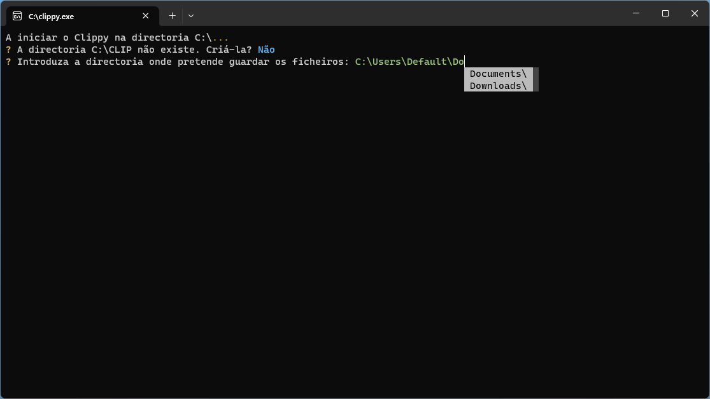
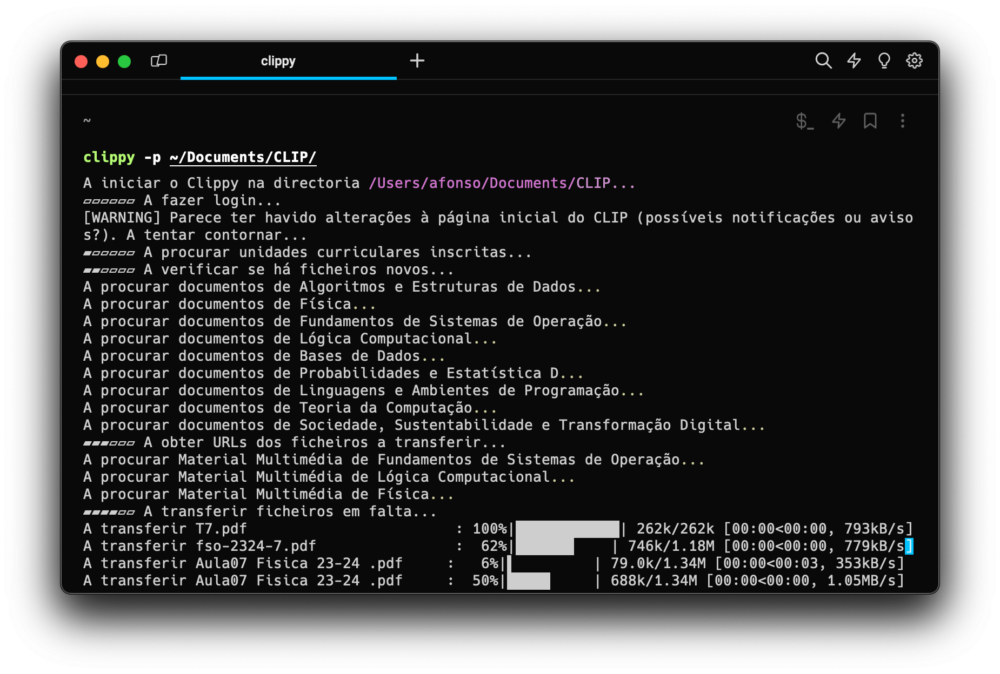

<div align="center">


# Clippy

## A simple file downloader for FCT-NOVA's <span color="#315259">CLIP</span>, in <span color="#315259">Py</span>thon (BETA)

  

by Afonso Brás Sousa

[](https://github.com/abtsousa/clippy/stargazers) [](https://github.com/abtsousa/clippy/blob/master/LICENSE)
</div>

### 🇵🇹 [Portuguese version here / Clica aqui para ler a descrição em Português](README-pt.md) 🇵🇹

Clippy is a simple web scraper and downloader for NOVA School of Science and Technology's internal e-learning platform, CLIP.

The program scrapes a user's courses for available downloads and syncs them with a local folder.

CLIP's files are organized in subcategories for each academic course like this:
Academic year >> Course documents >> Document subcategory >> Files list

Clippy successfully navigates the site in order to scrape it, and compares it to a local folder with a similar structure, keeping it in sync with the server.

Please note that the program is only available in Portuguese while it's still in BETA.

## Functionalities

- Cross-platform (tested on MacOS, Arch Linux and Windows).
- Extremely fast thanks to its asynchronous execution (allows checking up to 8 courses simultaneously).
- Transfer multiple files (up to 4 files simultaneously).
- Automatic file synchronization between CLIP and the user's folder.
- Support for choosing the academic year you want to download.
- Completely private, free, and open-source.

## Screenshots

  

## Install

**NOTE:** This program is in beta. [Star this repository](https://github.com/abtsousa/clippy/stargazers) to support the project and be notified of updates!

[Python](https://www.python.org/downloads/) ≥ v3.8 must be installed to build from source.

**Recommended (All platforms):** Build and install with pip:

```pip install https://github.com/abtsousa/clippy/archive/stable.zip```

**Alternative (Windows only):** Download clippy.exe from the [latest release page](https://github.com/abtsousa/clippy/releases/latest) and move it to where you want Clippy to save your files, then run it.

**Report any bugs here or to `ab.sousa@campus.fct[...etc]`**. You can use the `--debug` option to generate a debug.log file that you can attach in the email.

## Usage

Usage: `clippy [OPTIONS] COMMAND [ARGS]`

Help pages: `clippy --help` | `clippy batch --help` | `clippy single --help`

There are two main modes (commands): `batch` (default) and `single`

### Batch mode (default)

Downloads all available files for all the user's courses for the year.

#### Examples

- `clippy` Saves the files on a CLIP subfolder of the current path.
- `clippy --relogin --path C:\CLIP` Ignores saved credentials and saves the files in a CLIP folder inside the C: drive.
- `clippy --no-auto -p ~/CLIP` Lets the user choose which year they want to download and saves the files in a CLIP subfolder inside the home directory.

#### Options

All options are, by definition, optional.

```text
--username    -u  The user's username in CLIP.
--path        -p  The folder where CLIP files will be stored. Will use current working directory if empty.
--year        -y  The year to download.
--auto            Automatically chooses the latest year available. (on by default)
--relogin         Ignores saved login credentials. (off by default)
--version         Show program version.
--help            Show this message and exit.
```

### (NEW) Single mode

Downloads all available files for a single, specified course.

The user does not have to be enrolled to scrape the specified course. This is specially useful to download past files for a different course / year / semester that the user is not enrolled in.

#### Example

If I enrolled in **Análise Matemática I** (ID **11504** in CLIP) in 2023/2024 but I want to access the slides and exams for the previous school year (2022/**2023**), in the **first** semester, I just type:

`clippy single 11504 2023 1`

The program will now download all the files for the class for that semester.

#### Options

All options are, by definition, optional.

```text
--username    -u  The user's username in CLIP.
--path        -p  The folder where CLIP files will be stored. Will use current working directory if empty.
--is-trimester -t The course is trimestral.
--is-semester -s  The course is semestral (default)
--relogin         Ignores saved login credentials. (off by default)
--help            Show this message and exit.
```

## Privacy

The user's credentials are transmitted only to the CLIP servers and can optionally be saved in the local computer for future use. The program does not connect to any third-party servers.

The author does not obtain any information regarding the user or how the program is used, not even for telemetry purposes.

This program is provided "as is" and is strictly intended for private use, limited to its file download functionalities. By using this program, the user agrees to release the author from any liability for damages or consequences arising from misuse, including but not limited to, bugs, server errors, or unauthorized use of functionalities not originally intended.

## License and Copyright

Clippy was made in 2023 by Afonso Brás Sousa, a first-year computer science and engineering student @ FCT-NOVA.

Licensed under the GPL v3.

CLIP (c) 2023 FCT NOVA - Faculdade de Ciências e Tecnologia, 2829-516 Caparica, Portugal
